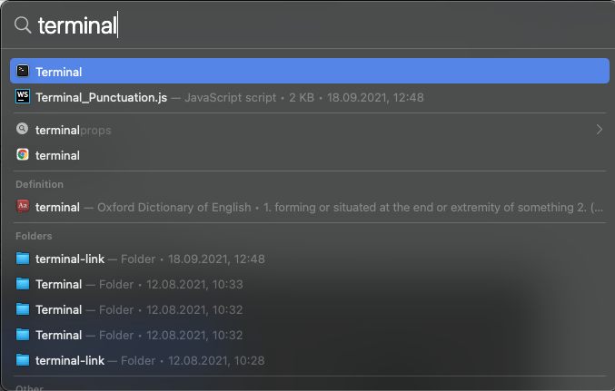

# Встановлення Python

## Встановлення віртуального оточення
### Встановлення pyenv на macOS

- відкрити `Terminal`:
  - натиснути`Command + Space`
  - у полі пошуку ввести `Terminal`
  - вибрати зі списку `Terminal`

  

- встановлення `brew`
    ```bash
    ruby -e "$(curl -fsSL https://raw.githubusercontent.com/Homebrew/install/master/install)"
    ```
- встановлення `pyenv`
    ```bash
    brew install pyenv
    ```
- встановлення pyenv-virtualenv
    ```bash
    brew install pyenv-virtualenv
    ```

### Встановлення pyenv на Linux
- відкрити `Terminal` використовуючи комбінацію клавіш `Ctrl-Alt+T`

- оновлення `apt`
  ```bash
  sudo apt update
  ```
  
- встановлення необхідних залежностей OS
  ```bash
  sudo apt-get install git python3-pip make build-essential \
  libedit-dev libncurses5-dev libssl-dev zlib1g-dev libbz2-dev \
  libreadline-dev libsqlite3-dev curl
  ```

- встановлення `pyenv`
  ```bash
  curl https://pyenv.run | bash
  ```
  
- оновлення конфігурації у `.bashrc` файлі
  ```bash
  echo 'export PYENV_ROOT="$HOME/.pyenv"' >> ~/.bashrc
  echo 'export PATH="$PYENV_ROOT/bin:$PATH"' >> ~/.bashrc
  echo 'eval "$(pyenv init -)"' >> ~/.bashrc
  echo 'eval "$(pyenv virtualenv-init -)"' >> ~/.bashrc
  ```
  
- перезапуск термінала
  ```bash
  exec $SHELL
  ```

### Windows
- запустити наступні команди у PowerShell
```powershell
Set-ExecutionPolicy RemoteSigned
Set-ExecutionPolicy Restricted
Set-ExecutionPolicy RemoteSigned -Scope CurrentUser
py -m pip install pyenv-win
```
- додади наступні шляхи до змінних оточення
```
C:\Users\User\.pyenv\pyenv-win\bin
C:\Users\User\.pyenv\pyenv-win\shims
C:\Users\User\AppData\Local\Programs\Python\Python310\Scrypts
```
#### Робота з `pyenv-win`
```powershell
pyenv
pyenv install --list
pyenv install 3.9.6
pyenv versions
pip install virtualenv
python -m venv env
.\env\Scripts\activate
deactivate
```

### Робота з `pyenv`
- встановлення необхідної версії Python в `pyenv`
    ```bash
    pyenv install <necessary python version> 
    ```
    > Приклади `<necessary python version>`: `3.8.0`, `3.6.5`, `2.7.3`

- створення віртуального оточення використовуючи `pyenv`
    ```bash
    pyenv virtualenv <necessary python version> <virtualenv name>
    ```
    >`necessary python version` повинна бути встановлена як це зазначено у попередньому пункті
    >
    >Приклади `virtualenv name`: `test`, `pet_project`, `my_app`.
    
    >Якщо Ви отримали помилку:
    ```
    Failed to activate virtualenv.
    
    Perhaps pyenv-virtualenv has not been loaded into your shell properly. Please restart current shell and try again.
    ```
    >Вам необхідно додати наступні рядки до `.bashrc` файлу та перезавантажити його:
    ```bash
    echo 'eval "$(pyenv init -)"' >> .bashrc
    echo 'eval "$(pyenv virtualenv-init -)"' >> .bashrc
    source ~/.bashrc
    ```


- активація віртуального оточення використовуючи `pyenv`
    ```bash
    pyenv activate <virtualenv name>
    ```
- 
- перевірка поточної версії Python в Terminal
    ```bash
    python --version
    ```

- запуск інтерпретатора Python в інтерактивному режимі
    ```bash
    python
    ```

- закриття інтерпретатора Python в інтерактивному режимі `Control + D`

- запуск файла Python в Terminal
    ```bash
    python <path to python file>  # ~/Desktop/hello.py
    ```

- деактивація віртуального оточення використовуючи `pyenv`
    ```bash
    pyenv deactivate 
    ```


- перевірити поточну версію Python в Terminal
    ```bash
    python --version
    ```
