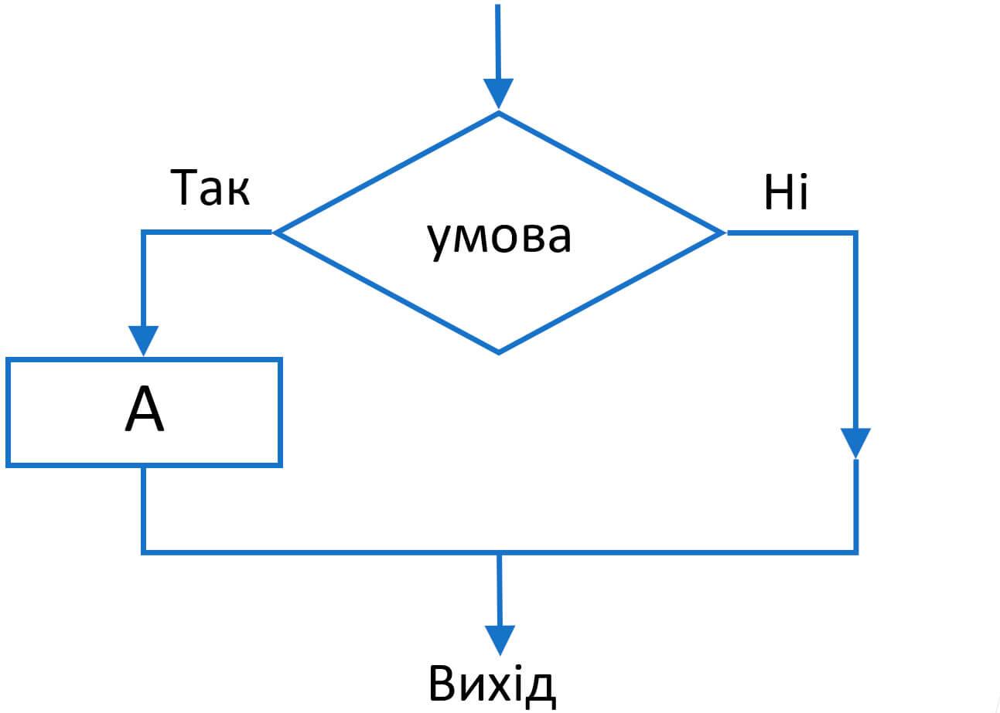
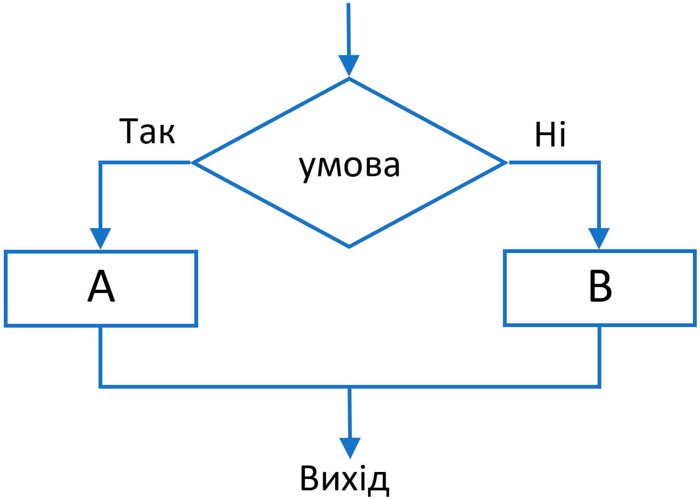
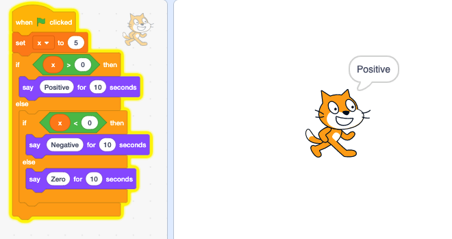
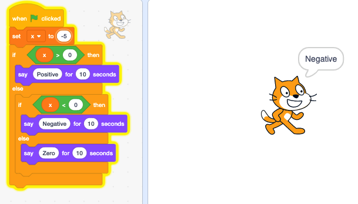
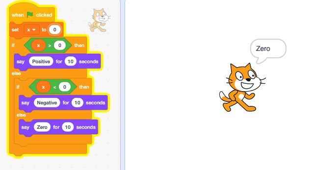
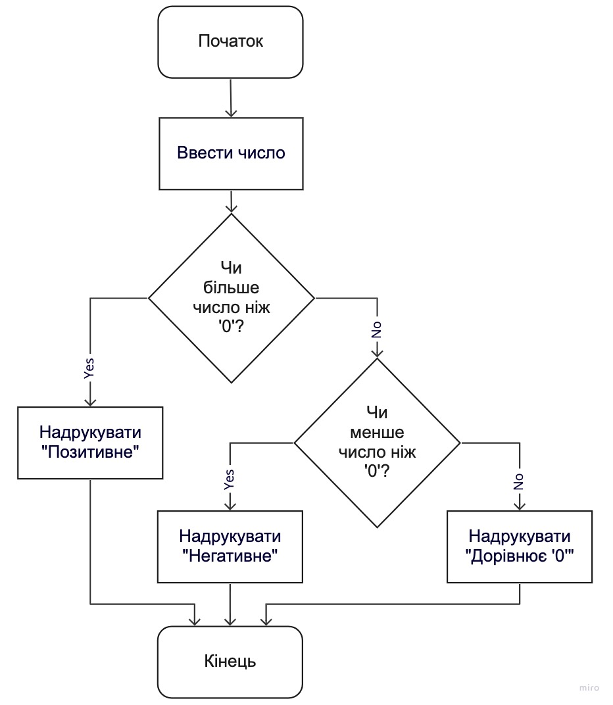

# Умови, логічні оператори, цикли, обробка помилок

## Умови
Умови в програмуванні використовуються для розгалуджень логіки програми 
коли якісь операції необхідно робити тільки у певних випадках. Наприклад 
програма має відправляти електронні листи тільки користувачам визначеного
почтового сервісу.

## Оператор if
Найпоширенішим типом оператора керування потоком є оператор `if`. 
Блок оператора `if` (тобто блок після оператора `if`) буде виконуватися, 
якщо умова оператора має значення `True`. Блок пропускається, якщо умова 
має значення `False`.

Скорочена схема умовного оператора:
    
    
```python
if <умова>:
    <виконати цю логіку>
```

Повна схема умовного оператора:
    
    
```python
if <умова>:
    <виконати цю логіку>
else:
    <виконати цю логіку якщо умова повертає False>
```

### Умови можуть бути вкладеними.
Один з найпростіших та популярних прикладів використання умов в програмуванні 
це програма яка друкує в консолі строку "Ви ввели позитивне число" якщо 
введене число більше за "0" та "Ви ввели негативне число" якщо 
введене число менше за "0".

Ось приклади роботи такої програми у Scratch:
- коли число позитивне

    
- коли число негативне

    
- коли число дорівнює "0"

    


Розглянемо блок-схему цієї програми:

    

Ця програма написана мовою Python:
```python
number = int(input("Введіть будь ласка число: "))
if number > 0:
    print("Ви ввели позитивне число")
else:
    if number < 0:
        print("Ви ввели негативне число")
    else:
        print("Ви ввели нуль")
```

Скорочена версія запису вкладеної умови
```python
number = int(input("Введіть будь ласка число: "))
if number > 0:
    print("Ви ввели позитивне число")
elif number < 0:
    print("Ви ввели негативне число")
else:
    print("Ви ввели нуль")
```

### Логічні оператори 

- `==` – дорівнює;
- `!>` – не дорівнює
- `>` – більше;
- `<` – менше;
- `>=` – більше або дорівнює;
- `<=` – менше або дорівнює.

`not` (не)
- not False = True
- not True = False

`and` (і)
- True and True = True
- True and False = False
- False and True = False
- False and False = False

`or` (або)
- True or True = True
- True or False = True
- False or True = True
- False or False = False

## Конвертація у тип bool 
Будь-який об'єкт будь-якого вбудованого типу даних може бути сконвертований у `bool`.
Приклад об'єктів які повернуть `False`:
```python
int_zero = 0
float_zero = 0.0
complex_zero = 0j
empty_str = ""
empty_list = []
empty_tuple = ()
empty_set = set()
empty_dict = {}
none = None
```
Усі решта повернуть `True`

### Конструкція `match-case` Python >= 3.10
```python
part_of_day = input("Введіть будь ласка час доби (ранок, день, вечір, не знаю): ")
match part_of_day:
    case "ранок":
        print("Добрий ранок")
    case "день":
        print("Добрий день")
    case "вечір":
        print("Добрий вечір")
    case _:
        print("Бажаю здоров'я")
```

Це еквівалент коду описаного вище:
```python
part_of_day = input("Введіть будь ласка час доби (ранок, день, вечір, не знаю): ")
if part_of_day == "ранок":
    print("Добрий ранок")
elif part_of_day == "день":
    print("Добрий день")
elif part_of_day == "вечір":
    print("Добрий вечір")
else:
    print("Бажаю здоров'я")
```
